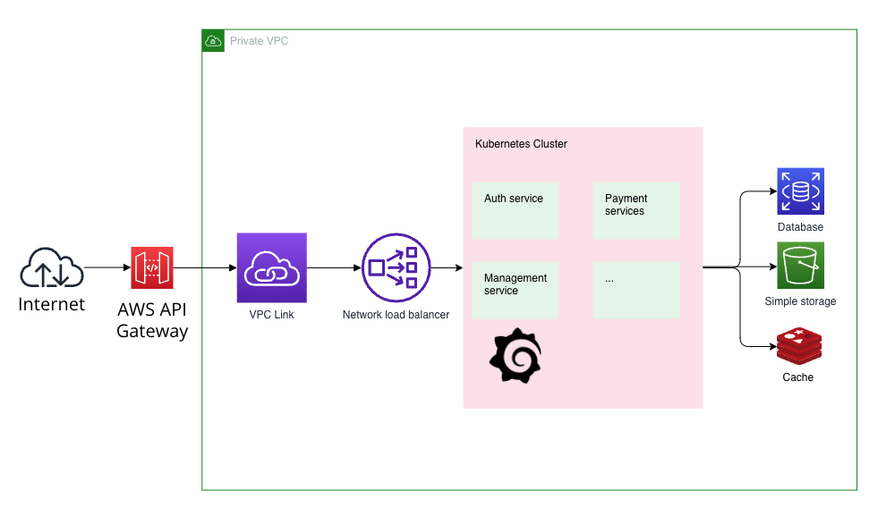

# Architecture diagram

# Cloud services used
- AWS S3: storage static files
- AWS API Gateway: API endpoints
- AWS CloudWatch: monitoring
- AWS CloudTrail: logging
- AWS EKS: container orchestration
- AWS Route 53: DNS
- AWS IAM: user management
- AWS VPC: network
- AWS RDS: database
- AWS ECR: container registry
- AWS CloudFront: CDN
- AWS WAF: web application firewall

# Plan for scaling
- Use AWS EKS for scalable container orchestration
- Implement a CI/CD pipeline (Terraform, Github Action)
- Use AWS RDS for scalable database
- Implement a load balancer with AWS Application Load Balancer
- Use AWS CloudFront for CDN
- Implement a WAF with AWS WAF